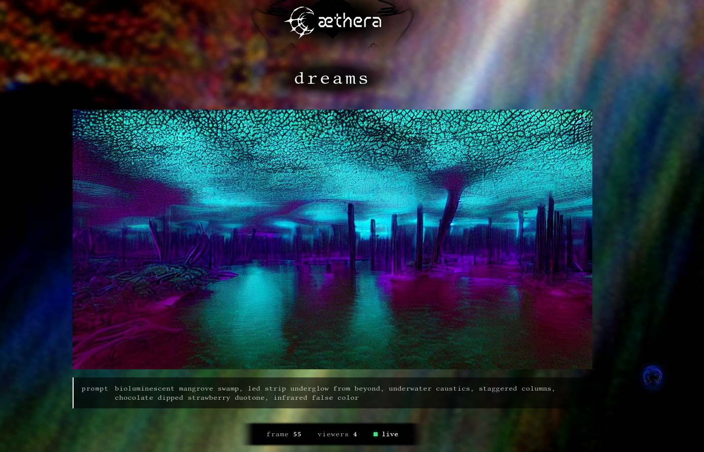
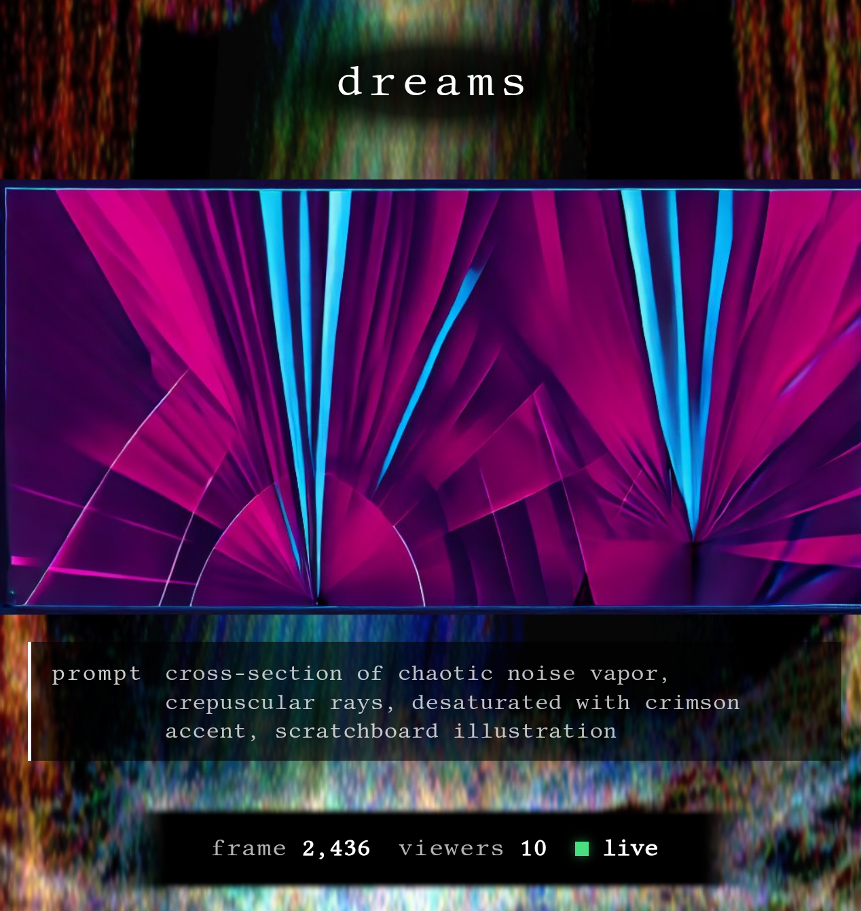

# dream_gen

**A truly infinite diffusion stream — continuous AI art that systematically explores latent space without ever collapsing.**

> *Watch it live at [aetherawi.red/dreams](https://aetherawi.red/dreams)*
> 
> *Part of the [Aethera](https://github.com/LuxiaSL/aethera) platform*
>
> *Made by [luxia](https://x.com/slLuxia) & [celeste](https://x.com/parafactual)*

<p align="center">
  
  
</p>

This isn't just morphing images. It's a self-sustaining generation loop that drifts through aesthetic space indefinitely — combining diffusion, interpolation, and a three-layer collapse prevention system that ensures it never gets stuck. The techniques all exist independently; diffusion, img2img feedback, VAE interpolation, perceptual hashing. But they haven't been put together quite like this before.

The result: a stream that runs for hours, days, weeks — producing frames that are fire-and-forget ephemeral, each one unique, systematically exploring combinations that emerge from the interplay of prompts, mutations, cache injections, and template swaps. All for about a dollar an hour.

---

## The Core Loop

```
                        ┌────────────────────────────────────────┐
                        │         COLLAPSE PREVENTION            │
                        │                                        │
                        │  Layer 1: Mutation   → BEND mode 0.7   │
                        │  Layer 2: Cache      → blend in ~60%   │
                        │  Layer 3: Swap       → fresh txt2img ──┼───┐
                        │                                        │   │
                        └────────────────────────────────────────┘   │
                                                                     │
╔════════════════════════════════════════════════════════════════════╪════════╗
║                                                                    │        ║
║                                                                    ▼        ║
║   ┌─────────────────────────────────────────────────────────────────────┐   ║
║   │                          KEYFRAME GENERATION                        │   ║
║   │                                                                     │   ║
║   │   KEYFRAME N-1  ───img2img───►  KEYFRAME N  ◄───  FRESH FRAME       │   ║
║   │        │          (0.2 drift      │              (txt2img on        │   ║
║   │        │           or 0.7 BEND)   │               startup/swap)     │   ║
║   │        │                          │                                 │   ║
║   └────────┼──────────────────────────┼─────────────────────────────────┘   ║
║            │                          │                                     ║
║            │                          │                                     ║
║            ▼                          ▼                                     ║
║   ┌──────────────────────────────────────────────────────────────────────┐  ║
║   │                           INTERPOLATION                              │  ║
║   │                                                                      │  ║
║   │        VAE encode ──► LATENT N-1 ◄──slerp──► LATENT N ◄── VAE encode │  ║
║   │                              │                                       │  ║
║   │                              ▼                                       │  ║
║   │                      12 blended latents                              │  ║
║   │                              │                                       │  ║
║   │                              ▼                                       │  ║
║   │                         VAE decode                                   │  ║
║   │                              │                                       │  ║
║   └──────────────────────────────┼───────────────────────────────────────┘  ║
║                                  │                                          ║
║                                  ▼                                          ║
║   ┌─────────────────────────────────────────────────────────────────────┐   ║
║   │                         OUTPUT STREAM                               │   ║
║   │                                                                     │   ║
║   │        12 interpolated frames  +  keyframe  ───►  WebSocket ───►    │   ║
║   │                                                                     │   ║
║   └─────────────────────────────────────────────────────────────────────┘   ║
║                                          │                                  ║
║                                          ▼                                  ║
║                                 (keyframe N becomes N-1)                    ║
║                                          │                                  ║
║                                          │                                  ║
╚══════════════════════════════════════════╪══════════════════════════════════╝
                                           │
                                     ┌─────┘
                                     │
                                     ▼
                               (loop continues)
```

1. **Startup**: txt2img generates a fresh frame from the combinatorial prompt system
2. **img2img**: Each keyframe evolves from the previous (denoise 0.2 DRIFT, or 0.7 BEND after mutations)
3. **Slerp**: VAE encodes both keyframes, spherically interpolates 12 latents, decodes all
4. **Stream**: All frames push to viewers — interpolations for smoothness, keyframes for evolution
5. **Collapse prevention**: Triggers at frame-count intervals, escalating through three layers

Each keyframe at 1024×512. Each interpolation frame decoded from blended latents. Frames stream to the VPS via WebSocket, broadcast to any browsers watching. Nothing stored permanently — it's all ephemeral, except for the screenshots I save.

---

## The Combinatorial Prompt System (designed & inspired by [celeste](https://x.com/parafactual))

This is where infinity comes from.

### Templates × Components = Billions of Prompts

**Templates** define prompt structure with slot placeholders:

```
"{subject_form} made of {material_substance}, {texture_density} surface, 
 {light_behavior}, {color_logic}, {medium_render}"
```

**Components** fill those slots from curated word pools:

```yaml
color_logic:
  - word: "split complementary palette"
    opposite: "monochrome"
  - word: "analogous warm tones"  
    opposite: "cool discord"
  - word: "iridescent color shift"
    opposite: "matte single hue"
  # ... 17 more
```

Each component has a **semantic opposite** — used both for negative prompt generation and for forced mutations during collapse prevention.

### 12 Visual Axes, ~20 Components Each

| Category | Examples | Role |
|----------|----------|------|
| `subject_form` | crystalline figure, weathered monument, recursive fractal | Primary visual entity |
| `material_substance` | oxidized copper, liquid mercury, volcanic glass | What it's made of |
| `texture_density` | eroded granular, tessellated geometric, fibrous organic | Surface quality |
| `light_behavior` | caustic light rays, subsurface scattering, light bleeding | How light interacts |
| `color_logic` | split complementary, triadic neon, monochrome with accent | Palette relationships |
| `atmosphere_field` | volumetric fog layers, particle suspension, heat distortion | Environmental media |
| `phenomenon_pattern` | crystalline growth, digital corruption, fluid dynamics | Visual processes |
| `spatial_logic` | golden spiral composition, radial symmetry, isometric grid | Compositional arrangement |
| `scale_perspective` | electron microscope view, aerial survey, macro lens | Viewing position |
| `temporal_state` | mid-dissolution, fossilizing, time-lapse bloom | Moment in transformation |
| `setting_location` | submerged cathedral, volcanic vent, abandoned server room | Environmental context |
| `medium_render` | cyanotype print, thermal imaging, oil paint impasto | Artistic technique |

### How the Word Lists Were Built

The components weren't just brainstormed — they were systematically expanded:

1. **Seed terms**: Hand-picked initial set per category with descriptions of what belongs
2. **LLM expansion**: Prompted Claude Opus 4.5 and Kimi-K2 to generate novel terms fitting each category's semantics
3. **Iteration**: Continued the loop until ~200 candidates per category
4. **Farthest-point sampling**: Computed CLIP text embeddings, selected 40 maximally-distant samples
5. **Manual curation**: Cleaned down to ~20 per category, ensuring semantic opposites exist

The result: word pools that are both diverse (far apart in embedding space) and coherent (all genuinely belong to their category). Each template uses 5-7 categories, meaning billions of possible prompt combinations — and that's before mutations start shifting things mid-stream.

---

## Three-Layer Collapse Prevention

The fundamental problem with img2img feedback loops: they converge. Small biases amplify. Everything trends toward a single color, a single composition, a fixed point.

dream_gen fights this with three escalating intervention layers, each with cooldowns that force variety from the layers above.

### Layer 1: Mutations (DRIFT → BEND)

During normal operation, the system runs in **DRIFT mode** — img2img at 0.2 denoise, slow aesthetic evolution within the current prompt.

Periodically (via modulo frame counting tuned from testing), a **mutation** triggers:
- Select a component category (weighted by visual impact)
- Swap the current word for its **semantic opposite** (or random if none)
- Enter **BEND mode** — denoise jumps to 0.7 for ~5 keyframes
- The new prompt takes effect quickly, pushing the image in a genuinely new direction

Then: cooldown. The mutation layer locks out, forcing any further intervention to come from Layer 2.

### Layer 2: Cache Injection

Over time, the system collects frames into a cache:
- **Keyframes** that show high uniqueness (via pHash-8 + ColorHist)
- **t=0.5 interpolation midpoints** — transitional states not present in keyframes

When Layer 2 triggers, a cached frame is selected for **maximum dissimilarity** to the current aesthetic and blended in at ~60% weight. The old visual trace remains, but the injection drags things toward a different region of color/structure space.

pHash-8 captures structural/compositional similarity. ColorHist (32 bins × HSV) captures palette. Together they cover the two main axes of mode collapse. Both run on CPU, leaving GPU free for diffusion and interpolation.

Then: longer cooldown. If this layer triggers too frequently within a time window, it "breaks" — escalating to Layer 3.

### Layer 3: Template Swap

The emergency reset. When mutations and cache injections aren't enough:

1. **Fresh frame** generated via txt2img from a new template + random components
2. Blended in at **~90% weight** — almost complete replacement, trace of the old
3. The cache carries forward (those unique frames are still valuable)
4. New prompt, new structure, new starting point
5. The exploration continues down a completely different branch

To make this instant, fresh frames are **pre-generated** at startup — one per template, with their prompts ready for downstream mutations. As each gets used, it regenerates in the background. The system never waits.

---

## What Makes This Interesting

> "I expected morphing images. But this is genuinely exploring latent space in a systematic manner. Continuously."

The emergent behaviors are what make it worth watching:

- **Visible shifts**: You can *see* when the lighting component changes, when color logic mutates, when structure reorganizes. It's like watching what an image would look like if generated with a different prompt — while maintaining information from the original.

- **Pseudo-determinism**: Even at full denoising, img2img carries a trace of its source. The starting frame propagates forward as a kind of seed. Mutations push against it but never fully escape. Template swaps are the only true breaks.

- **Backwards engineering**: Knowing all the templates and components, try to guess the prompt from a frame. It's surprisingly hard — even for 1-2 components. The combinatorial explosion and mutation history make each frame's lineage opaque.

- **Cache hits**: The frames that make it into the cache (high uniqueness in both color AND structure) tend to be the most visually striking. When they get reinjected later, they bring back moments that worked.

- **Infinite without repetition**: Before the combinatorial system, things hovered around the static seed images. Now every fresh frame is genuinely novel, every mutation pathway unexplored, every template swap a new beginning. The flywheel is off.

---

## Technical Details

| Spec | Value |
|------|-------|
| Resolution | 1024×512 |
| Keyframe generation | ~1.5s (SD 1.5 via ComfyUI) |
| Interpolation | 12 frames via VAE slerp, ~0.15s each |
| Effective FPS | ~5 frames/second streamed |
| Cache metrics | pHash-8 (structure) + ColorHist (color), CPU-based |
| Cloud cost | Runs on dedicated B200 via Heimdall |
| Storage | None — frames are ephemeral |

### Architecture

```
┌─────────────────┐     WebSocket       ┌─────────────────┐     WebSocket       ┌─────────────────┐
│  GPU (B200)     │ ──────────────────► │  VPS (Aethera)  │ ──────────────────► │  Browsers       │
│  dream_gen      │   Binary frames     │  Frame Hub      │   Binary frames     │  /dreams        │
└─────────────────┘                     └─────────────────┘                     └─────────────────┘
```

The GPU runs autonomously. Frames push to the VPS. The VPS broadcasts to any connected viewers and manages GPU lifecycle (spin up when viewers arrive, spin down after grace period). State syncs periodically for resume across restarts.

---

## Project Structure

```
dream_gen/
├── backend/
│   ├── core/                    # Generation loop, orchestration
│   ├── cache/                   # pHash + ColorHist similarity, LRU cache
│   ├── cloud/                   # WebSocket client, frame pushing, state sync
│   ├── interpolation/           # VAE encode/decode, slerp
│   ├── prompts/                 # CombinatorialPromptSystem
│   └── config.yaml              # All the knobs
├── prompts/
│   ├── templates.yaml           # 12+ prompt structures
│   ├── components.yaml          # 12 categories × ~20 words each
│   └── components_embeddings.npz # Pre-computed for similarity selection
├── daemon.py                    # Production process manager
└── docker/                      # Calibration image + deployment docs
```

### Running Locally

```bash
# Clone
git clone https://github.com/LuxiaSL/dream_gen.git
cd dream_gen

# Install (requires Python 3.11+, NVIDIA GPU, ComfyUI)
uv venv && .venv/Scripts/activate  # or source .venv/bin/activate
uv sync

# Configure
cp backend/config.yaml backend/config.local.yaml
# Edit paths, enable/disable cloud mode

# Run
uv run daemon.py  # Manages ComfyUI + generation loop
```

See [docs/INSTALLATION_GUIDE.md](docs/INSTALLATION_GUIDE.md) for detailed Windows desktop setup.
See [docs/CONFIG_REFERENCE.md](docs/CONFIG_REFERENCE.md) for all configuration options.

---

## Gallery

<p align="center">
  
  <br>
  
  <br>
  
  <br>
  
  <br>
  <em>Frames captured from the stream — each one ephemeral, each one unique</em>
</p>

---

## License

MIT License — see [LICENSE](LICENSE) for details.

## Acknowledgments

- **[celeste](https://x.com/parafactual)**, my muse and co-conspirator
- **[ComfyUI](https://github.com/comfyanonymous/ComfyUI)** — The generation backend
- **Stable Diffusion** — Making this level of AI art accessible
- **Claude** — Component list expansion and curation assistance
